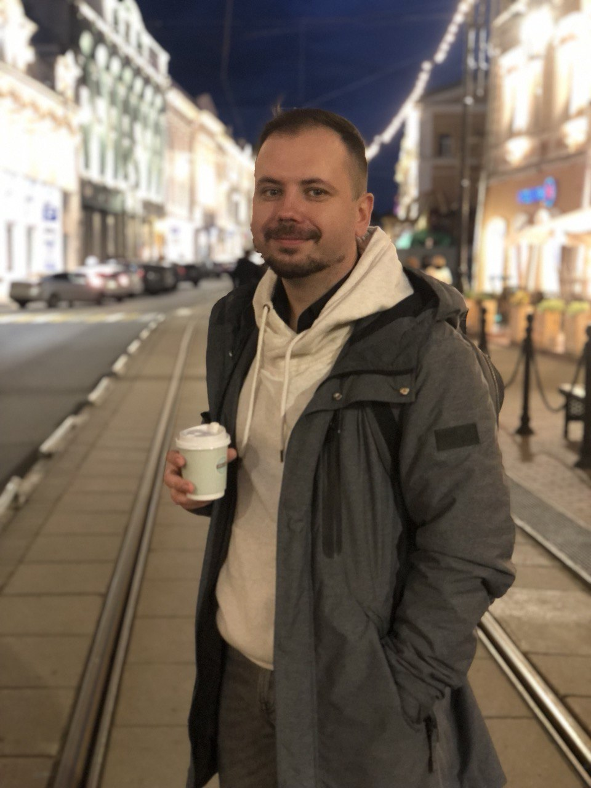

# Антон Бачурин

## Привет! Я начинающий _frontend_ - разработчик.

Несколько фактов обо мне:

- Я учусь в Нетологии
- Живу в городе Ульяновске
- Изучаю следующие языки: 
1. __HTML__
2. __CSS__
3. __JavaScript__

Это я

А это моя помощница - ___Джина___

